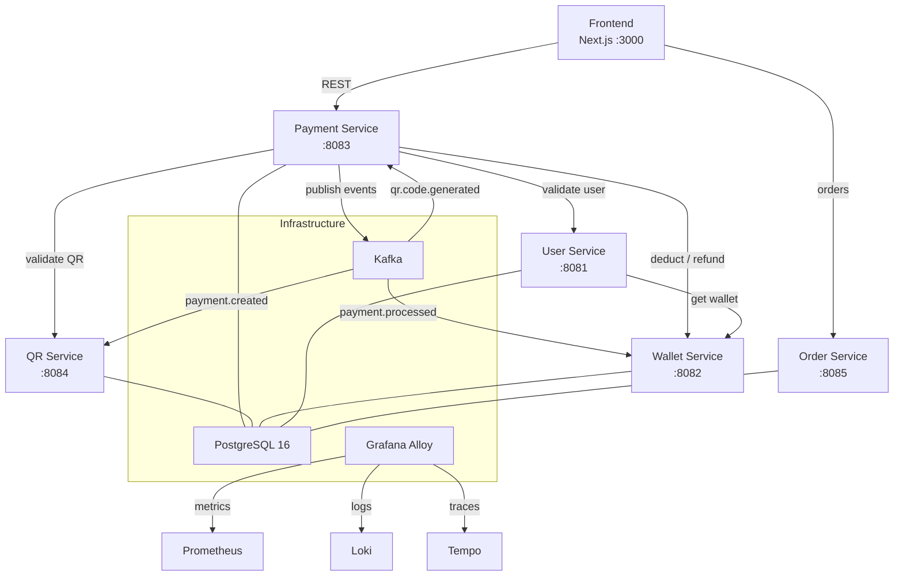
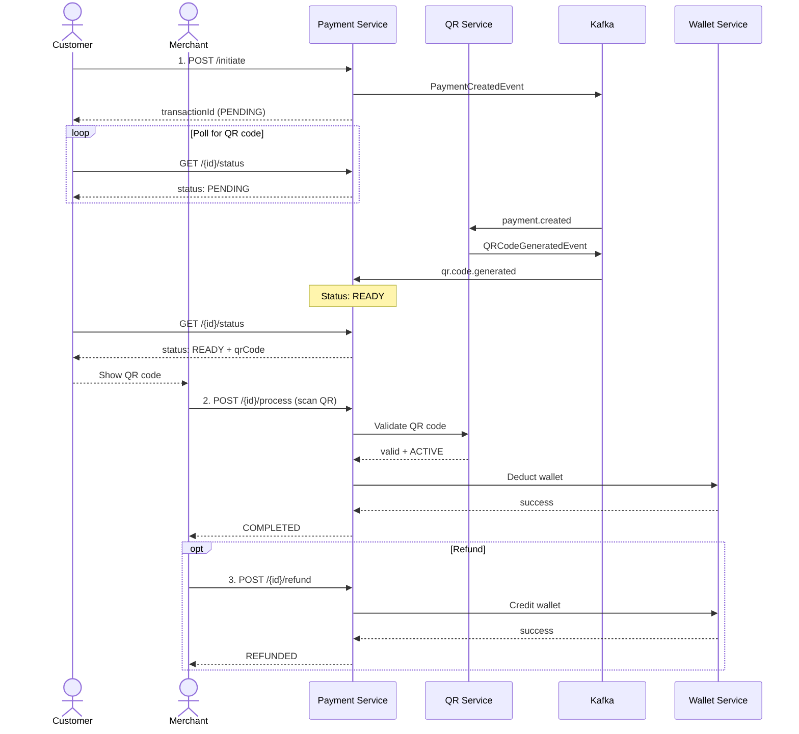

# QR Payment System - Microservices

A full-stack QR code payment system built with microservices architecture, featuring event-driven communication, distributed tracing, and comprehensive testing.

## Architecture



## Tech Stack

| Layer | Technology |
|-------|-----------|
| Frontend | Next.js 14, React 18, TypeScript, Tailwind CSS |
| Backend | Java 21, Spring Boot 4, Spring Data JPA, Flyway |
| Messaging | Apache Kafka (KRaft mode) |
| Database | PostgreSQL 16 (one DB per service) |
| Observability | OpenTelemetry Java Agent, Grafana, Loki, Tempo, Prometheus, Alloy |
| Testing | JUnit 5, Mockito, Cucumber BDD, k6 (load tests), Toxiproxy (fault injection) |
| API Docs | Springdoc OpenAPI / Swagger UI |
| Containerization | Docker, Docker Compose |

## Microservices

| Service | Port | Database | Description |
|---------|------|----------|-------------|
| **user-service** | 8081 | user_db | User management, validation |
| **wallet-service** | 8082 | wallet_db | Wallet balances, deductions, top-ups |
| **payment-service** | 8083 | payment_db | Payment lifecycle (initiate, process, refund, cancel) |
| **qr-service** | 8084 | qr_db | QR code generation and validation |
| **order-service** | 8085 | merchant_db | Merchant orders |

## Payment Flow



### Key Design Decisions

- **Idempotency keys** on initiate, process, and refund endpoints to prevent duplicate charges
- **HTTP calls outside `@Transactional`** to avoid database connection pool exhaustion
- **Transactional outbox pattern** for reliable Kafka event publishing
- **Structured error codes** (e.g. `INSUFFICIENT_BALANCE`, `QR_CODE_EXPIRED`) for programmatic client handling
- **Single atomic wallet deduction** (no hold/capture flow)

## Getting Started

### Prerequisites

- Docker & Docker Compose
- Java 21 (for local backend development)
- Node.js 18+ (for local frontend development)

### Run Everything with Docker

```bash
# Start infrastructure + all services
docker compose up -d

# Check status
docker compose ps
```

### Run Locally (Development)

```bash
# 1. Start infrastructure only
docker compose up -d postgres kafka grafana-alloy loki tempo prometheus grafana kafka-ui

# 2. Run backend services (each in a separate terminal)
cd backend/user-service    && ./mvnw spring-boot:run
cd backend/wallet-service  && ./mvnw spring-boot:run
cd backend/payment-service && ./mvnw spring-boot:run
cd backend/qr-service      && ./mvnw spring-boot:run
cd backend/order-service   && ./mvnw spring-boot:run

# 3. Run frontend
cd frontend && npm install && npm run dev
```

## Service URLs

| Service | URL |
|---------|-----|
| Frontend | http://localhost:3000 |
| Payment Service API | http://localhost:8083/api/v1/payments |
| Swagger UI (Payment) | http://localhost:8083/swagger-ui.html |
| OpenAPI Spec | http://localhost:8083/v3/api-docs |
| Grafana | http://localhost:3001 (admin/admin) |
| Prometheus | http://localhost:9090 |
| Kafka UI | http://localhost:38080 |

## Testing

### Unit Tests

```bash
cd backend/payment-service
./mvnw test
```

### BDD Tests (Cucumber)

Business-readable scenarios in Gherkin covering payment initiation, processing, refund, and idempotency.

```bash
cd backend/payment-service
./mvnw test -Dtest=CucumberTestRunner
```

Feature files: `src/test/resources/features/`
- `payment-initiation.feature` -- initiate flow, user validation
- `payment-processing.feature` -- QR scan, balance check, state validation
- `payment-refund.feature` -- full/partial refund, amount limits
- `payment-idempotency.feature` -- duplicate request handling

HTML report generated at: `target/cucumber-reports/report.html`

### Load Tests (k6)

```bash
# Start load test profile
docker compose --profile loadtest up -d toxiproxy

# Baseline payment flow
docker compose --profile loadtest run k6 run /scripts/payment-flow.js

# Network fault injection
docker compose --profile loadtest run k6 run /scripts/network-fault.js
```

See [`infra/load-tests/README.md`](infra/load-tests/README.md) for Toxiproxy setup and scenarios.

## Observability

All services are instrumented with the **OpenTelemetry Java Agent** (auto-instrumentation, gRPC protocol). Telemetry flows through **Grafana Alloy** to:

- **Prometheus** -- metrics (JVM, HTTP, Kafka)
- **Loki** -- structured logs
- **Tempo** -- distributed traces

Open **Grafana** at http://localhost:3001 and use the **Explore** view to query each datasource.

## Project Structure

```
.
├── backend/
│   ├── db-init/                  # PostgreSQL init scripts (create databases)
│   ├── user-service/             # User management
│   ├── wallet-service/           # Wallet operations
│   ├── payment-service/          # Payment lifecycle + BDD tests + OpenAPI
│   ├── qr-service/               # QR code generation/validation
│   └── order-service/            # Merchant orders
├── frontend/                     # Next.js app (payments, store, users)
├── infra/
│   ├── observability/
│   │   ├── alloy-config.alloy          # Grafana Alloy telemetry pipeline
│   │   ├── prometheus-config.yml       # Prometheus scrape config
│   │   ├── tempo-config.yaml           # Tempo trace storage config
│   │   └── grafana-provisioning/       # Grafana datasource/dashboard provisioning
│   └── load-tests/
│       ├── payment-flow.js             # k6 baseline load test
│       ├── network-fault.js            # k6 network fault test
│       ├── setup-toxiproxy.sh          # Toxiproxy setup (bash)
│       └── setup-toxiproxy.ps1         # Toxiproxy setup (PowerShell)
├── bruno/                        # API collection (Bruno)
├── docker-compose.yml            # Full stack definition
└── README.md
```

## API Error Codes (Payment Service)

| Error Code | Meaning |
|------------|---------|
| `INSUFFICIENT_BALANCE` | Wallet balance too low |
| `QR_CODE_INVALID` | QR code validation failed |
| `QR_CODE_EXPIRED` | QR code is no longer active |
| `QR_CODE_MISMATCH` | QR code belongs to a different payment |
| `INVALID_PAYMENT_STATE` | Operation not allowed for current payment status |
| `USER_VALIDATION_FAILED` | User is inactive or wallet is inactive |
| `WALLET_SERVICE_ERROR` | Wallet service unavailable |
| `SERVICE_UNAVAILABLE` | Downstream service unavailable or timed out (circuit open) |
| `DUPLICATE_REQUEST` | Idempotency key already used |
| `REFUND_EXCEEDS_AMOUNT` | Refund amount greater than payment amount |
